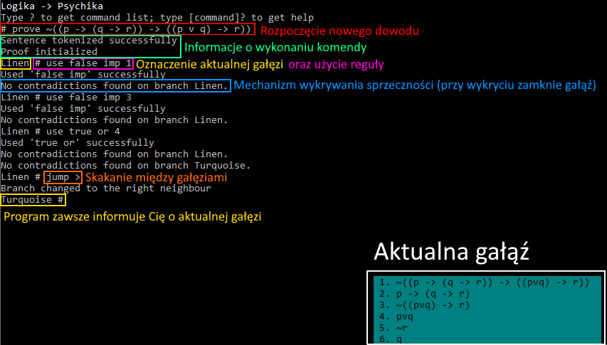

# :leaves: Larch :leaves:

## Opis dla każdego

*Larch* jest składającym się z **modułów** systemem służącym do **wspomagania dowodzenia**. W tym projekcie skupiamy się na poprawie metod **dydaktyki logiki** chcąc doprowadzić do możliwości **dowodzenia tylko i wyłącznie myszką**.

> The truth is only one click away!

## Opis dla niektórych

*Larch* jest silnikiem wspomagania dowodzenia opartym na silnej implementacji Plugin Oriented Programming. Projekt rozwijany jest w celach dydaktycznych - aby odciążyć studentów od przepisywania zdań oraz rozpisywania reguł, dając tym samym możliwość skupienie się na strategii dowodu. Zaawansowanym użytkownikom oferowana jest możliwość tworzenia systemów dowodzenia, parserów, form wydruku, a nawet interfejsów.

## Instalacja

Larch *jeszcze* nie posiada profesjonalnych metod instalacji, w związku z czym możesz skorzystać z poniższego tutorialu.

1. Upewnij się, że masz zainstalowany co najmniej **Python 3.9**
2. Uruchom konsolę swojego systemu operacyjnego.
3. Zainstaluj wymagane paczki. Możesz to zrobić komendą `python -m pip install -r requirements.txt` będąc w folderze z programem (`cd [ścieżka do folderu]` może się przydać). Możesz też zainstalować wszystkie paczki oddzielnie:
   1. Zainstaluj paczkę `prompt-toolkit` za pomocą komendy `python -m pip install prompt_toolkit`. Istnieje duża szansa, że już go posiadasz (korzysta z niego chociażby ipython).
   2. Zainstaluj paczkę `anytree` za pomocą komendy `python -m pip install prompt_toolkit`
4. Pobierz **release** programu z [tego miejsca](https://github.com/PogromcaPapai/Larch/releases)

Aplikacja powinna być zainstalowana, w razie problemów zapraszamy do kontaktu przez [podane tutaj platformy](https://www.notion.so/szymanski/Contributing-fca3bb2330794dc682732a08752a1fb8#3dc32cec72874db48f40b2601540b01f)

## Użycie i uruchamianie

### Uruchamianie

Dostępne są 3 metody uruchamiania:

1. Jeżeli używasz Windowsa, kliknij dwukrotnie na plik `start.bat`. Jeśli używasz Linuxa/Maca, użyj `start.sh` (nie miałem okazji testować, ale powinno działać).
2. `cd [FOLDER Z PROGRAMEM]`; `python start.py`
3. `python [FOLDER Z PROGRAMEM]\start.py`

### Użycie

Aktualnie *Larch* oferuje tylko interfejs oparty na komendach. Na poniższym zrzucie ekranu możesz zapoznać się z jego schematem:

Najważniejsze komendy dostępne w interfejsie:

- `?` przywołuje listę wszystkich komend, `[komenda]?` przywołuje pomoc dla danej komendy,
- `prove [zdanie]` rozpoczyna dowód; możesz go opuścić z pomocą `leave`,
- w trakcie dowodzenia możesz używać komendy `use [reguła] [kontekst]` do użycia reguły,
- listę dostępnych reguł znajdziesz w podpowiedziach podczas wpisywania oraz pod komendą `get rules`, która poda także informacje o wymaganiach danej reguły (na przykład poinformuje o potrzebie podania *Sentence ID*, czyli numeru zdania w gałęzi),
- **w każdym momencie dowodu znajdujesz się na pewnej gałęzi**, zmieniać możesz je komendą `jump [nazwa gałęzi/>/<]`, lub `next` (ta przeniesie Cię do następnej otwartej gałęzi),
- swój dowód możesz wyświetlić w łatwiejszej do zrozumienia formie z pomocą komendy `get tree`, gałąź możesz wyświetlić komendą `get branch`,

*Larch* oferuje też wewnętrzny system pluginów, ich listę możesz wyświetlić komendą `plugin list [nazwa gniazda/all]`. Pluginy możesz zmieniać komendą `plugin switch [gniazdo/aktualnie podłączony plugin] [nowy plugin]`.

Więcej informacji na temat uruchomienia znajdziesz w dokumentacji (tu będzie link, gdy taka powstanie).

## Contributing

Zapraszamy do zapoznania się z naszą [dokumentacją](https://www.notion.so/szymanski/Contributing-fca3bb2330794dc682732a08752a1fb8#f3fb30b566cf4ecb9a1173b578229736) na ten temat!

### Zgłaszanie błędów

Błędy (oraz propozycje) można zgłaszać za pomocą [Notion](https://www.notion.so/szymanski/4a180f6826464e9dac60dd9c18c5ac0b?v=56fec8f735024f94ab421aa97cab3dc8). Na powyższej stronie możesz znaleźć przycisk New. Powinna wyświetlić Ci się pusta strona z możliwością wyboru wzoru. Wybierz odpowiedni i wypełnij formularz. Postaraj się wyjaśnić jak najdokładniej, co się stało - każdy szczegół może okazać się przydatny! Jeśli masz pomysł, co mogło spowodować błąd, możesz spróbować samemu go naprawić!

Bardzo przydatne jest dla nas dołączenie crash reportu, który możesz znaleźć w folderze `crashes`. Chętnie przyjmiemy też plik `config.json`!

### Tworzenie pluginów

Projekt Larch został utworzony tak, aby umożliwić każdej chętnej osobie tworzenie autorskich metod dowodzenia, formatów wydruku, formatów zapisów, czy interfejsów. 

Możesz skopiować wzór pluginu z pomocą komendy `plugin gen [nazwa gniazda] [nazwa pluginu]`. Znajdziesz w nim zestaw wzorów funkcji, które wymagane są od danego pluginu. Type hinting podpowie Ci, co dany plugin przyjmuje, a co zwraca dana funkcja. Skorzystaj z docstringów wewnątrz kodu oraz [dokumentacji](https://www.notion.so/szymanski/c162be5ad2a042da816a04bb1d704bf8?v=9725078b87e940ab93a5c9950b455d4d). Nie bój się z nami kontaktować - nie ma głupich pytań, są tylko głupie filmiki w internecie!

### Dołącz do drzewnej drużyny

*Larch* jest projektem potrzebującym ludzi z szerokiego spektrum umiejętności. Potrzebujemy zarówno logików, programistów, testerów, jak i projektantów oraz grafików. W związku z tym chętnie przyjmujemy każdego do naszej społeczności - jeżeli uważasz, że możesz nam się przydać, to prawdopodobnie tak jest!

Jeśli chcesz się zaangażować, możesz skontaktować się z dowolnym z autorów.

## Autorzy

- Jakub Dakowski (@PogromcaPapai) - :crown: Benevolent dictator for life :crown:
- Barbura Adamska - Chief Bzdury Officer :chart_with_upwards_trend:
- Robert Szymański (@rsxxi) - PM/UX unicorn :unicorn:
- Ola Draszewska (@nerdolo) - Confused coder :space_invader:
- Łukasz Abramowicz (@ghostbuster265) - I arise from depths of my parents basement to code or sth :pizza:
Oraz wszyscy, którzy bacznie przyglądali się rozwojowi aplikacji.

### Autorzy pluginów

- Michał Gajdziszewski - algorytm printujący w `actual_tree`

## Licencja

Korzystamy z licencji [GNU GPL 3.0](COPYING)
